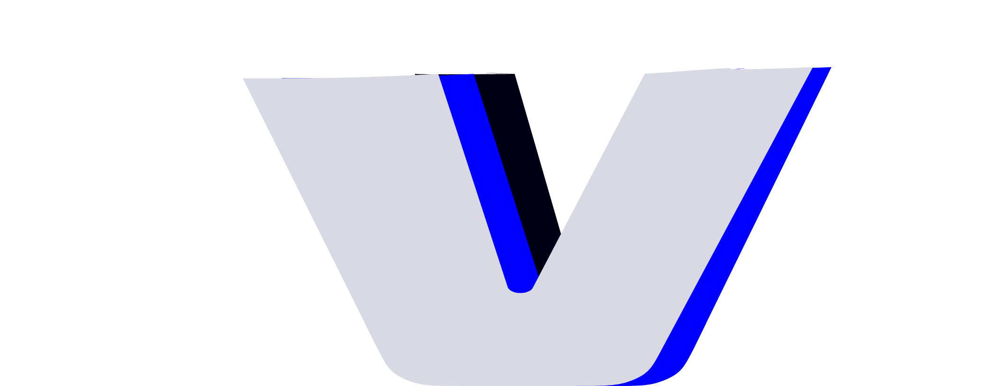

<p align="center">
  
  <br/><br/>
  <a href="https://wromo.build">Wromo</a> is a website build tool for the modern web &mdash;
  <br/>
  powerful developer experience meets lightweight output.
  <br/><br/>
</p>

## Install


```bash
# Recommended!
npm create wromo@latest

# Manual:
npm install --save-dev wromo
```

Looking for help? Start with our [Getting Started](https://docs.wromo.build/en/getting-started/) guide.  

Looking for quick examples? [Open a starter project](https://wromo.new/) right in your browser.
## Documentation

Visit our [offical documentation](https://docs.wromo.build/).  

## Support

Having trouble? Get help in the official [Wromo Discord](https://wromo.build/chat).
## Contributing

**New contributors welcome!** Check out our [Contributors Guide](CONTRIBUTING.md) for help getting started. 

Join us on [Discord](https://wromo.build/chat) to meet other maintainers. We'll help you get your first contribution in no time!

## Directory

| Package                                                 | Release Notes                                                                                                                     |
| ------------------------------------------------------- | --------------------------------------------------------------------------------------------------------------------------------- |
| [wromo](packages/wromo)                                 | [](packages/wromo/CHANGELOG.md)                                 |
| [create-wromo](packages/create-wromo)                   | [](packages/create-wromo/CHANGELOG.md)            |
| [@wromojs/react](packages/integrations/react)           | [](packages/integrations/react/CHANGELOG.md)           |
| [@wromojs/preact](packages/integrations/preact)         | [](packages/integrations/preact/CHANGELOG.md)         |
| [@wromojs/solid-js](packages/integrations/solid)        | [](packages/integrations/solid-js/CHANGELOG.md)     |
| [@wromojs/svelte](packages/integrations/svelte)         | [](packages/integrations/svelte/CHANGELOG.md)         |
| [@wromojs/vue](packages/integrations/vue)               | [](packages/integrations/vue/CHANGELOG.md)               |
| [@wromojs/lit](packages/integrations/lit)               | [](packages/integrations/lit/CHANGELOG.md)               |
| [@wromojs/deno](packages/integrations/deno)             | [](packages/integrations/deno/CHANGELOG.md)             |
| [@wromojs/netlify](packages/integrations/netlify)       | [](packages/integrations/netlify/CHANGELOG.md)       |
| [@wromojs/vercel](packages/integrations/vercel)         | [](packages/integrations/vercel/CHANGELOG.md)         |
| [@wromojs/partytown](packages/integrations/partytown)   | [](packages/integrations/partytown/CHANGELOG.md)   |
| [@wromojs/sitemap](packages/integrations/sitemap)       | [](packages/integrations/sitemap/CHANGELOG.md)       |
| [@wromojs/tailwind](packages/integrations/tailwind)     | [](packages/integrations/tailwind/CHANGELOG.md)     |
| [@wromojs/turbolinks](packages/integrations/turbolinks) | [](packages/integrations/turbolinks/CHANGELOG.md) |

Several official projects are maintained outside of this repo:

| Project                                                             | Repository                                                              |
| ------------------------------------------------------------------- | ----------------------------------------------------------------------- |
| [@wromojs/compiler](packages/integrations/compiler)                 | [Wromo/compiler](https://github.com/Wromo/compiler)             |
| [Wromo Language Tools](https://github.com/Wromo/language-tools) | [Wromo/language-tools](https://github.com/Wromo/language-tools) |


## Links

- [License (MIT)](LICENSE)
- [Code of Conduct](CODE_OF_CONDUCT.md)
- [Open Governance & Voting](GOVERNANCE.md)
- [Project Funding](FUNDING.md)
- [Website](https://wromo.build/)

## Sponsors

Wromo is generously supported by Netlify, Vercel, and several other amazing organizations.

[❤️ Sponsor Wromo! ❤️](FUNDING.md)

### Platinum Sponsors

<table>
  <tbody>
    <tr>
      <td align="center"><a href="https://www.netlify.com/#gh-light-mode-only" target="_blank"></a><a href="https://www.netlify.com/#gh-dark-mode-only" target="_blank">
      </a></td>
      <td align="center"><a href="https://www.vercel.com/#gh-light-mode-only" target="_blank"></a><a href="https://www.vercel.com/#gh-dark-mode-only">
      </a></td>
    </tr>
  </tbody>
</table>

### Gold Sponsors

<table>
  <tbody>
    <tr>
      <td align="center">
        <a href="https://divRIOTS.com#gh-light-mode-only" target="_blank">
        
        </a>
        <a href="https://divRIOTS.com#gh-dark-mode-only" target="_blank">
        
        </a>
      </td>
      <td align="center">
        <a href="https://stackupdigital.co.uk/#gh-light-mode-only" target="_blank">
        
        </a>
        <a href="https://stackupdigital.co.uk/#gh-dark-mode-only" target="_blank">
        
        </a>
      </td>
    </tr>
  </tbody>
</table>

### Sponsors

<table>
  <tbody>
    <tr>
      <td align="center"><a href="https://sentry.io" target="_blank"></a></td><td align="center"><a href="https://qoddi.com" target="_blank"></a></td>
    </tr>
  </tbody>
</table>
